```mermaid
graph RL
core_wcm_components_accordion_v1_accordion["core/wcm/components/accordion/v1/accordion"]
core_wcm_components_breadcrumb_v2_breadcrumb["core/wcm/components/breadcrumb/v2/breadcrumb"]
core_wcm_components_button_v1_button["core/wcm/components/button/v1/button"]
core_wcm_components_carousel_v1_carousel["core/wcm/components/carousel/v1/carousel"]
core_wcm_components_container_v1_container["core/wcm/components/container/v1/container"]
core_wcm_components_contentfragment_v1_contentfragment["core/wcm/components/contentfragment/v1/contentfragment"]
core_wcm_components_contentfragmentlist_v1_contentfragmentlist["core/wcm/components/contentfragmentlist/v1/contentfragmentlist"]
core_wcm_components_download_v1_download["core/wcm/components/download/v1/download"]
core_wcm_components_embed_v1_embed["core/wcm/components/embed/v1/embed"]
core_wcm_components_experiencefragment_v1_experiencefragment["core/wcm/components/experiencefragment/v1/experiencefragment"]
core_wcm_components_form_button_v2_button["core/wcm/components/form/button/v2/button"]
core_wcm_components_form_container_v2_container["core/wcm/components/form/container/v2/container"]
core_wcm_components_form_container_v2_container_new["core/wcm/components/form/container/v2/container/new"]
core_wcm_components_form_hidden_v2_hidden["core/wcm/components/form/hidden/v2/hidden"]
core_wcm_components_form_options_v2_options["core/wcm/components/form/options/v2/options"]
core_wcm_components_form_text_v2_text["core/wcm/components/form/text/v2/text"]
core_wcm_components_image_v2_image["core/wcm/components/image/v2/image"]
core_wcm_components_languagenavigation_v1_languagenavigation["core/wcm/components/languagenavigation/v1/languagenavigation"]
core_wcm_components_list_v2_list["core/wcm/components/list/v2/list"]
core_wcm_components_navigation_v1_navigation["core/wcm/components/navigation/v1/navigation"]
core_wcm_components_page_v2_page["core/wcm/components/page/v2/page"]
core_wcm_components_pdfviewer_v1_pdfviewer["core/wcm/components/pdfviewer/v1/pdfviewer"]
core_wcm_components_progressbar_v1_progressbar["core/wcm/components/progressbar/v1/progressbar"]
core_wcm_components_search_v1_search["core/wcm/components/search/v1/search"]
core_wcm_components_separator_v1_separator["core/wcm/components/separator/v1/separator"]
core_wcm_components_sharing_v1_sharing["core/wcm/components/sharing/v1/sharing"]
core_wcm_components_tabs_v1_tabs["core/wcm/components/tabs/v1/tabs"]
core_wcm_components_teaser_v1_teaser["core/wcm/components/teaser/v1/teaser"]
core_wcm_components_text_v2_text["core/wcm/components/text/v2/text"]
core_wcm_components_title_v2_title["core/wcm/components/title/v2/title"]
cq_experience_fragments_components_xffacebook["cq/experience-fragments/components/xffacebook"]
cq_experience_fragments_components_xfpage["cq/experience-fragments/components/xfpage"]
cq_experience_fragments_components_xfpinterest["cq/experience-fragments/components/xfpinterest"]
wknd_components_accordion["wknd/components/accordion"]
wknd_components_breadcrumb["wknd/components/breadcrumb"]
wknd_components_button["wknd/components/button"]
wknd_components_byline["wknd/components/byline"]
wknd_components_carousel["wknd/components/carousel"]
wknd_components_container["wknd/components/container"]
wknd_components_contentfragment["wknd/components/contentfragment"]
wknd_components_contentfragmentlist["wknd/components/contentfragmentlist"]
wknd_components_download["wknd/components/download"]
wknd_components_embed["wknd/components/embed"]
wknd_components_experiencefragment["wknd/components/experiencefragment"]
wknd_components_form_button["wknd/components/form/button"]
wknd_components_form_container["wknd/components/form/container"]
wknd_components_form_container_new["wknd/components/form/container/new"]
wknd_components_form_hidden["wknd/components/form/hidden"]
wknd_components_form_options["wknd/components/form/options"]
wknd_components_form_text["wknd/components/form/text"]
wknd_components_image["wknd/components/image"]
wknd_components_image_list["wknd/components/image-list"]
wknd_components_languagenavigation["wknd/components/languagenavigation"]
wknd_components_list["wknd/components/list"]
wknd_components_navigation["wknd/components/navigation"]
wknd_components_page["wknd/components/page"]
wknd_components_pdfviewer["wknd/components/pdfviewer"]
wknd_components_progressbar["wknd/components/progressbar"]
wknd_components_search["wknd/components/search"]
wknd_components_separator["wknd/components/separator"]
wknd_components_sharing["wknd/components/sharing"]
wknd_components_tabs["wknd/components/tabs"]
wknd_components_teaser["wknd/components/teaser"]
wknd_components_text["wknd/components/text"]
wknd_components_title["wknd/components/title"]
wknd_components_xffacebook["wknd/components/xffacebook"]
wknd_components_xfpage["wknd/components/xfpage"]
wknd_components_xfpinterest["wknd/components/xfpinterest"]
wknd_components_accordion --> core_wcm_components_accordion_v1_accordion
wknd_components_breadcrumb --> core_wcm_components_breadcrumb_v2_breadcrumb
wknd_components_button --> core_wcm_components_button_v1_button
wknd_components_byline --> core_wcm_components_image_v2_image
wknd_components_carousel --> core_wcm_components_carousel_v1_carousel
wknd_components_container --> core_wcm_components_container_v1_container
wknd_components_contentfragment --> core_wcm_components_contentfragment_v1_contentfragment
wknd_components_contentfragmentlist --> core_wcm_components_contentfragmentlist_v1_contentfragmentlist
wknd_components_download --> core_wcm_components_download_v1_download
wknd_components_embed --> core_wcm_components_embed_v1_embed
wknd_components_experiencefragment --> core_wcm_components_experiencefragment_v1_experiencefragment
wknd_components_form_button --> core_wcm_components_form_button_v2_button
wknd_components_form_container --> core_wcm_components_form_container_v2_container
wknd_components_form_container_new --> core_wcm_components_form_container_v2_container_new
wknd_components_form_hidden --> core_wcm_components_form_hidden_v2_hidden
wknd_components_form_options --> core_wcm_components_form_options_v2_options
wknd_components_form_text --> core_wcm_components_form_text_v2_text
wknd_components_image --> core_wcm_components_image_v2_image
wknd_components_image_list --> core_wcm_components_list_v2_list
wknd_components_languagenavigation --> core_wcm_components_languagenavigation_v1_languagenavigation
wknd_components_list --> core_wcm_components_list_v2_list
wknd_components_navigation --> core_wcm_components_navigation_v1_navigation
wknd_components_page --> core_wcm_components_page_v2_page
wknd_components_pdfviewer --> core_wcm_components_pdfviewer_v1_pdfviewer
wknd_components_progressbar --> core_wcm_components_progressbar_v1_progressbar
wknd_components_search --> core_wcm_components_search_v1_search
wknd_components_separator --> core_wcm_components_separator_v1_separator
wknd_components_sharing --> core_wcm_components_sharing_v1_sharing
wknd_components_tabs --> core_wcm_components_tabs_v1_tabs
wknd_components_teaser --> core_wcm_components_teaser_v1_teaser
wknd_components_text --> core_wcm_components_text_v2_text
wknd_components_title --> core_wcm_components_title_v2_title
wknd_components_xffacebook --> cq_experience_fragments_components_xffacebook
wknd_components_xfpage --> cq_experience_fragments_components_xfpage
wknd_components_xfpinterest --> cq_experience_fragments_components_xfpinterest
```

# Structure analysis of Adobe AEM WKND site

https://wknd.site/us/en.html

## Report of primary types and resource types etc.

See [AnalyzeSite](AnalyzeSite.md).

Primtypes:
cq:LiveCopy	11
cq:Page	120
cq:PageContent	121
nt:file	2
nt:folder	1
nt:resource	2
nt:unstructured	3294
rep:CugPolicy	2

Mixins:
cq:LiveRelationship	2280
cq:LiveSync	11
cq:PropertyLiveSyncCancelled	5
dam:Thumbnails	1
mix:versionable	64
rep:CugMixin	3

sling:resourceType sorted by key:
	1336
dam/cfm/components/grid	267
wcm/foundation/components/responsivegrid	78
wknd/components/accordion	3
wknd/components/breadcrumb	48
wknd/components/button	6
wknd/components/carousel	51
wknd/components/container	495
wknd/components/contentfragment	213
wknd/components/download	6
wknd/components/experiencefragment	45
wknd/components/image	333
wknd/components/image-list	30
wknd/components/list	21
wknd/components/page	121
wknd/components/separator	43
wknd/components/sharing	69
wknd/components/tabs	51
wknd/components/teaser	40
wknd/components/text	57
wknd/components/title	240

sling:resourceType sorted by count:
	1336
wknd/components/container	495
wknd/components/image	333
dam/cfm/components/grid	267
wknd/components/title	240
wknd/components/contentfragment	213
wknd/components/page	121
wcm/foundation/components/responsivegrid	78
wknd/components/sharing	69
wknd/components/text	57
wknd/components/carousel	51
wknd/components/tabs	51
wknd/components/breadcrumb	48
wknd/components/experiencefragment	45
wknd/components/separator	43
wknd/components/teaser	40
wknd/components/image-list	30
wknd/components/list	21
wknd/components/button	6
wknd/components/download	6
wknd/components/accordion	3

## Component structure

See [AnalyzeSite](AnalyzeSite.md).

## Report of primary types and resource types etc.

nt:unstructured null: (1198 times)
- jcr:mixinTypes (67%)
- offset (63%)
- width (63%)
- link (3%)
- text (3%)
- behavior (1%)
+ nt:unstructured null (66%)
+ nt:unstructured wknd/components/image (1%)
+ nt:file null (0%)

nt:unstructured wknd/components/container: (495 times)
- jcr:mixinTypes (65%)
- layout (36%)
- cq:styleIds (23%)
- cq:panelTitle (4%)
- jcr:title (1%)
+ nt:unstructured wknd/components/container (60%)
+ nt:unstructured wknd/components/title (42%)
+ nt:unstructured null (17%)
+ nt:unstructured wknd/components/contentfragment (14%)
+ nt:unstructured wknd/components/sharing (14%)
+ nt:unstructured wknd/components/carousel (11%)
+ nt:unstructured wknd/components/tabs (10%)
+ nt:unstructured wknd/components/breadcrumb (10%)
+ nt:unstructured wknd/components/experiencefragment (9%)
+ nt:unstructured wknd/components/separator (9%)
+ nt:unstructured wknd/components/image (8%)
+ nt:unstructured wknd/components/text (8%)
+ nt:unstructured wknd/components/teaser (6%)
+ nt:unstructured wknd/components/list (4%)
+ nt:unstructured wknd/components/image-list (2%)
+ nt:unstructured wknd/components/button (1%)
+ nt:unstructured wknd/components/download (1%)
+ nt:unstructured wknd/components/accordion (1%)

nt:unstructured wknd/components/image: (333 times)
- fileReference (100%)
- jcr:mixinTypes (67%)
- altValueFromDAM (60%)
- displayPopupTitle (60%)
- isDecorative (60%)
- titleValueFromDAM (60%)
- imageCrop (9%)
- jcr:title (5%)
- alt (3%)
- cq:panelTitle (2%)
+ nt:unstructured null (5%)

nt:unstructured dam/cfm/components/grid: (267 times)
- jcr:mixinTypes (67%)
+ nt:unstructured wknd/components/image (67%)
+ nt:unstructured wknd/components/title (12%)
+ nt:unstructured wknd/components/text (6%)

nt:unstructured wknd/components/title: (240 times)
- type (75%)
- jcr:title (68%)
- jcr:mixinTypes (67%)
- cq:styleIds (49%)
+ nt:unstructured null (25%)

nt:unstructured wknd/components/contentfragment: (213 times)
- displayMode (100%)
- elementNames (100%)
- fragmentPath (100%)
- variationName (100%)
- text (85%)
- cq:panelTitle (68%)
- jcr:mixinTypes (67%)
- paragraphScope (66%)
- cq:styleIds (31%)
- paragraphHeadings (1%)
+ nt:unstructured dam/cfm/components/grid (125%)
+ nt:unstructured wcm/foundation/components/responsivegrid (37%)
+ nt:unstructured wknd/components/container (27%)
+ nt:unstructured null (25%)

cq:PageContent wknd/components/page: (121 times)
- cq:lastModified (100%)
- cq:lastModifiedBy (100%)
- cq:template (100%)
- jcr:title (100%)
- jcr:mixinTypes (79%)
- jcr:description (69%)
- cq:tags (67%)
- socialMedia (57%)
- jcr:baseVersion (53%)
- jcr:isCheckedOut (53%)
- jcr:predecessors (53%)
- jcr:uuid (53%)
- jcr:versionHistory (53%)
- pageTitle (18%)
- cq:conf (12%)
- cq:lastTranslationUpdate (11%)
- jcr:language (10%)
- cq:lastReplicated (7%)
- cq:lastReplicatedBy (7%)
- cq:lastReplicationAction (7%)
- shortDescription (5%)
- cq:propertyInheritanceCancelled (4%)
- cq:redirectTarget (3%)
- hideInNav (3%)
- cq:lastTranslationDone (2%)
- cq:translationMethod (2%)
- cq:translationProject (2%)
- cq:translationProviderCloudConfig (2%)
- cq:translationProviderName (2%)
- cq:translationStatus (2%)
- cq:allowedTemplates (1%)
- sling:configRef (1%)
+ nt:unstructured wknd/components/container (99%)
+ cq:LiveCopy null (9%)
+ nt:unstructured null (1%)

cq:Page null: (120 times)
- jcr:mixinTypes (3%)
+ cq:PageContent wknd/components/page (100%)
+ cq:Page null (93%)
+ rep:CugPolicy null (2%)

nt:unstructured wcm/foundation/components/responsivegrid: (78 times)
- jcr:mixinTypes (67%)
+ nt:unstructured wknd/components/image (12%)

nt:unstructured wknd/components/sharing: (69 times)
- jcr:mixinTypes (67%)
+ nt:unstructured null (70%)

nt:unstructured wknd/components/text: (57 times)
- text (100%)
- textIsRich (100%)
- jcr:mixinTypes (67%)
- cq:styleIds (42%)
+ nt:unstructured null (26%)

nt:unstructured wknd/components/carousel: (52 times)
- cq:styleIds (98%)
- jcr:mixinTypes (65%)
- autopauseDisabled (58%)
- autoplay (58%)
- delay (12%)
+ nt:unstructured wknd/components/image (185%)
+ nt:unstructured wknd/components/teaser (17%)

nt:unstructured wknd/components/tabs: (51 times)
- accessibilityLabel (94%)
- jcr:mixinTypes (67%)
+ nt:unstructured wknd/components/contentfragment (282%)
+ nt:unstructured null (94%)
+ nt:unstructured wknd/components/image-list (35%)

nt:unstructured wknd/components/breadcrumb: (48 times)
- cq:styleIds (100%)
- disableShadowing (100%)
- hideCurrent (100%)
- showHidden (100%)
- startLevel (100%)
- jcr:mixinTypes (67%)

nt:unstructured wknd/components/experiencefragment: (45 times)
- fragmentVariationPath (100%)
- jcr:mixinTypes (67%)
- cq:styleIds (47%)
+ nt:unstructured null (53%)

nt:unstructured wknd/components/separator: (43 times)
- jcr:mixinTypes (77%)
- cq:styleIds (49%)
+ nt:unstructured null (14%)

nt:unstructured wknd/components/teaser: (40 times)
- actionsEnabled (100%)
- cq:styleIds (100%)
- descriptionFromPage (100%)
- fileReference (100%)
- textIsRich (100%)
- titleFromPage (100%)
- jcr:title (85%)
- jcr:mixinTypes (75%)
- cq:panelTitle (48%)
- jcr:description (45%)
- id (15%)
- pretitle (15%)
+ nt:unstructured null (108%)

nt:unstructured wknd/components/image-list: (30 times)
- childDepth (100%)
- listFrom (100%)
- sortOrder (100%)
- tagsMatch (100%)
- orderBy (70%)
- jcr:mixinTypes (67%)
- cq:panelTitle (60%)
- tags (50%)
- parentPage (20%)
- maxItems (10%)
- pages (10%)

nt:unstructured wknd/components/list: (21 times)
- childDepth (100%)
- cq:styleIds (100%)
- linkItems (100%)
- listFrom (100%)
- maxItems (100%)
- orderBy (100%)
- parentPage (100%)
- showDescription (100%)
- showModificationDate (100%)
- sortOrder (100%)
- tagsMatch (100%)
- jcr:mixinTypes (67%)

cq:LiveCopy null: (11 times)
- cq:isDeep (100%)
- cq:master (100%)
- cq:rolloutConfigs (100%)

nt:unstructured wknd/components/button: (6 times)
- accessibilityLabel (100%)
- cq:styleIds (100%)
- jcr:title (100%)
- link (100%)
- jcr:mixinTypes (67%)

nt:unstructured wknd/components/download: (6 times)
- actionText (100%)
- descriptionFromAsset (100%)
- fileReference (100%)
- inline (100%)
- jcr:description (100%)
- jcr:title (100%)
- textIsRich (100%)
- titleFromAsset (100%)
- jcr:mixinTypes (67%)

nt:unstructured wknd/components/accordion: (3 times)
- headingElement (100%)
- singleExpansion (100%)
- jcr:mixinTypes (67%)
+ nt:unstructured wknd/components/container (700%)
+ nt:unstructured null (100%)

nt:file null: (2 times)
+ nt:resource null (100%)

nt:resource null: (2 times)
- jcr:data (100%)
- jcr:mimeType (100%)
- jcr:uuid (100%)
- jcr:mixinTypes (50%)
+ nt:folder null (50%)

rep:CugPolicy null: (2 times)
- rep:principalNames (100%)

nt:folder null: (1 times)
+ nt:file null (100%)
